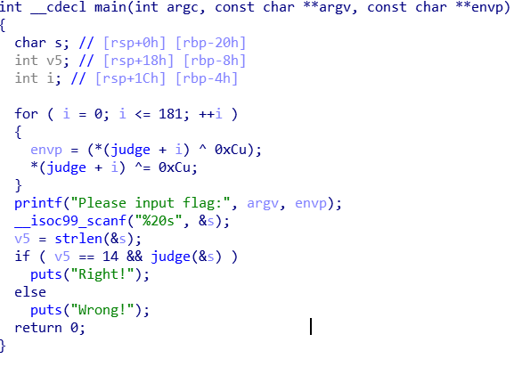
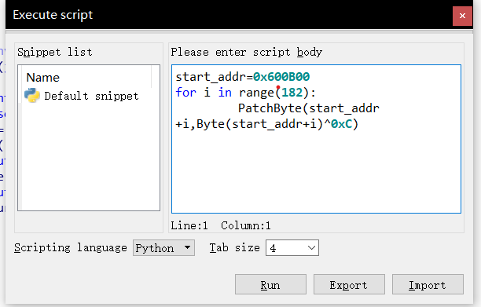
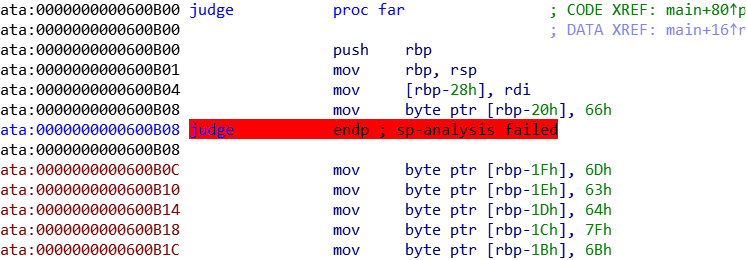
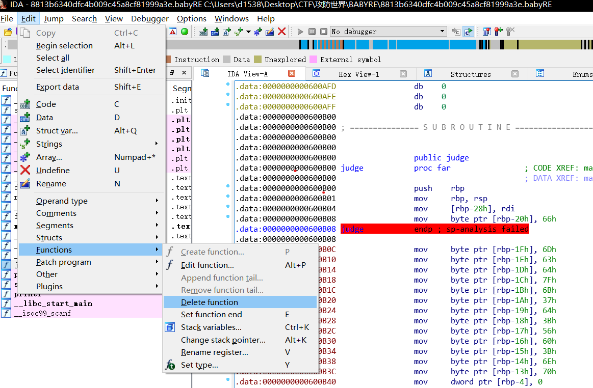
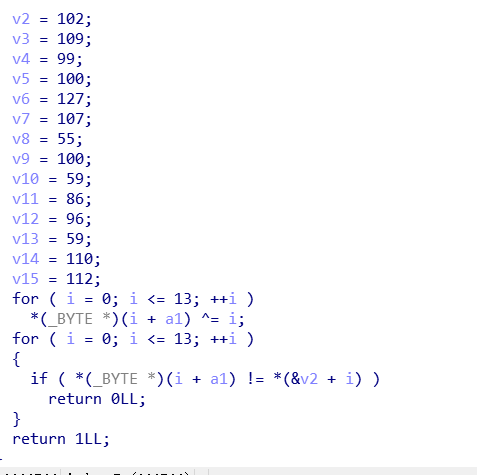

XCTF BABYRE(smc题(self-Modifying Code))

先放进ida



逻辑很简单，知道最关键的函数是judge，但是一点judge发现没法反汇编，再看这个的开头，发现judge函数被加密了。

这种情况可以有两种办法：

（1）动态调试

（2）解密

动态调试应该是比较好理解的，这里主要介绍一下第二种解密。

利用idapython写解密脚本，这个题还是比较好逆的，开头写的很清楚，把judge函数的开始地址到开始地址+181的值异或上0xc，逆回去不过是再异或0xc一遍

按shift+f2，写解密脚本，去百度查查idapython的使用方法，这里找到一篇https://www.52pojie.cn/forum.php?mod=viewthread&tid=1117330



run了之后来到原来不能反汇编的地方



选中红的那行



再选中judge右键点create function，再f5就能反编译judge了

然后进judge函数，逻辑很简单，就是输入异或下标，再和给定的数比较



```python
v=[0x66,0x6d,0x63,0x64,0x7f,0x6b,0x37,0x64,0x3b,0x56,0x60,0x3b,0x6e,0x70]
j=0
for i in v:
   i^=j
   j+=1
   print(chr(i),end='')
```

flag{n1c3_j0b}

