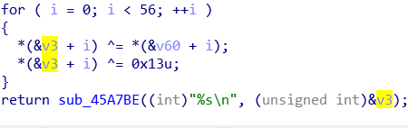
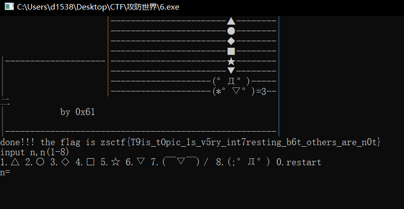

攻防世界新手区005，挺有意思的一个题

是个游戏题，开始没想着把它直接玩通，就直接放进ida，里面看找到最关键的函数



sub_45a7be就是个printf，这里会打印v3，v3就是flag，上面for循环变换了一下v3，逆过来就行了。v3和v60都是上面的数组。

```python
v3=[123,32,18,98,119,108,65,41,124,80,125,38,124,111,74,49,83,108,94,108,84,6,96,83,44,121,104,110,32,95,117,101,99,123,127,119,96,48,107,71,92,29,81,107,90,85,64,12,43,76,86,13,114,1,117,126,0]
v60=[18,64,98,5,2,4,6,3,6,48,49,65,32,12,48,65,31,78,62,32,49,32,1,57,96,3,21,9,4,62,3,5,4,1,2,3,44,65,78,32,16,97,54,16,44,52,32,64,89,45,32,65,15,34,18,16,0]

a=[]
for i in range(56):
    v3[i]=v3[i]^v60[i]
    v3[i]^=19
    a.append(chr(v3[i]))

print(''.join(a))
```

得到flag

`zsctf{T9is_tOpic_1s_v5ry_int7resting_b6t_others_are_n0t}`

然后呢去看了下wp，这个题的游戏逻辑挺简单的，也就是说能纯玩出来，依次出入1-8就行。（草）



