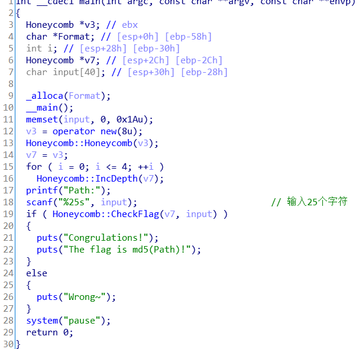
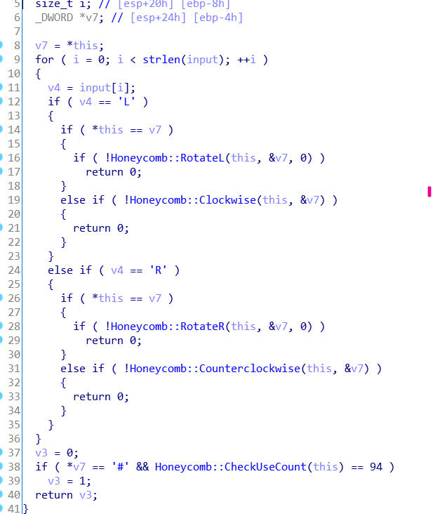

hash ctf honeycomb （2020西湖论剑Cellular）

ida打开，发现这是一道迷宫题，不过只能输入L和R。本来想把map给构造出来，结果构造迷宫的那个函数有亿点复杂，就放弃了，最后还是采用爆破的方式来解这个题。

checkflag

在最后个return v3下断点，动态调试，从LLLLLLLLLLLLLLLLLLLLLLLLL开始试，当到断点时，看下i的值，就知道哪个下标不对了，相应地改成R或者L，注意的是，有些下标是既能为L也能为R的，只是走到后面走不通了，比如第一个下标，L和R都能走，但L到后面走不通，这时就得退回到第一个下标处，重新检测，所以每个下标检测的时候，R和L都试一下，记一下能走两条路的下标。（反正慢慢试吧，主要不会写代码来爆破....）

最后试出来是，RLRLLRLLLRRLLRLLRLRLLRLLR

md5一下，flag{b144da06ead3c5585cf18ce942055857}

