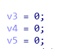
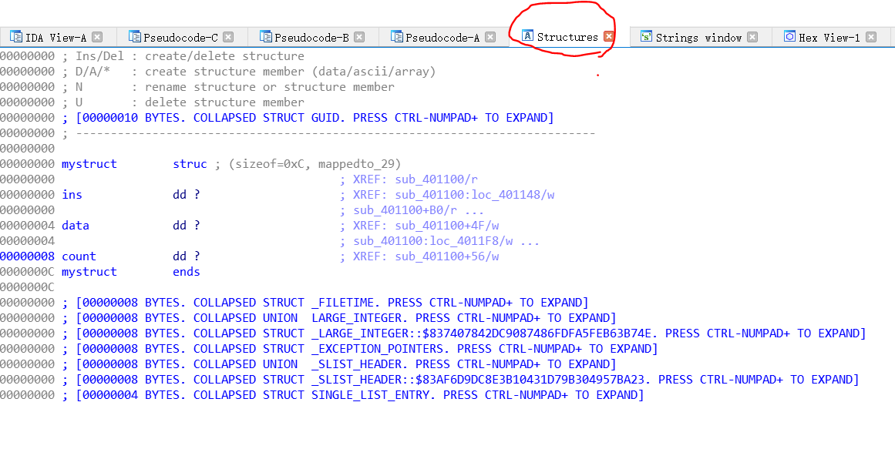
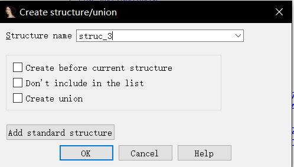
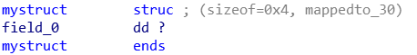
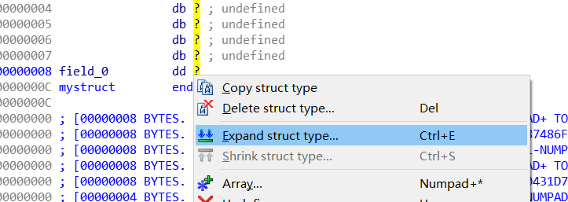
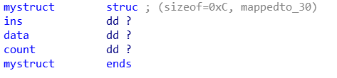
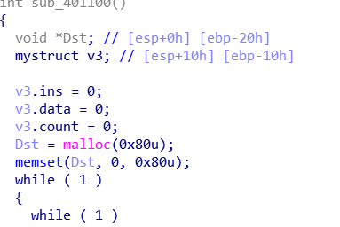
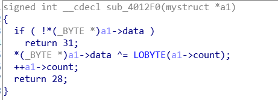

接re-easyvm这题，里面有个这个

这三个变量我们分析之后发现，这应该是一个结构体里面的东西。那么下面介绍一下如何在ida里面新建一个结构体。

先来到structures页面（快捷键shift+f9）

按insert键

然后就出现这个

对着ends那一行按d键，就会添加一个结构体成员，然后对着它按d可以切换它的数据类型

因为题里三个变量都是int，所以选择dd

因为我们需要三个成员变量，所以选中field_0，右键，选择expand

因为按字节expand，所以扩充8个字节，再给每个变量重命名一下

最后就是这样

然后在函数里面将v3的变量类型设为mystruct

再把sub_4012f0那个函数里面的a1变成mystruct*

这样逻辑就清晰特别多了。

