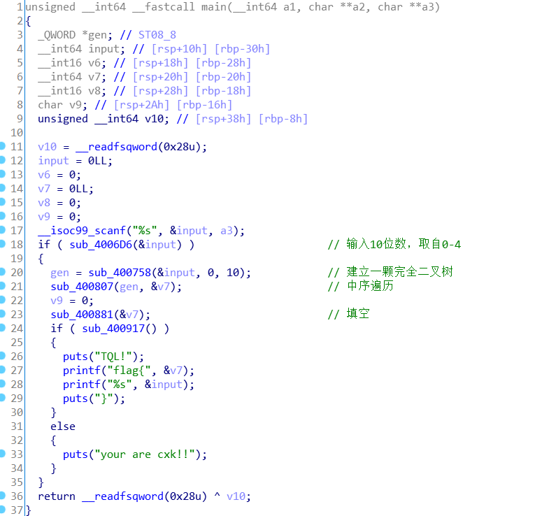
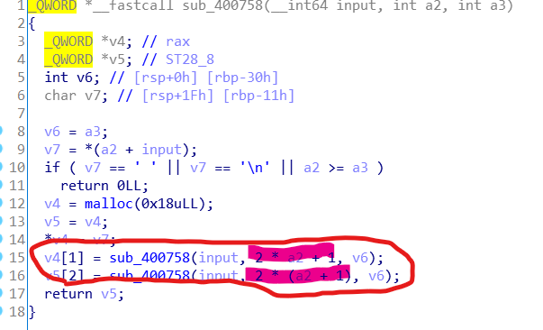
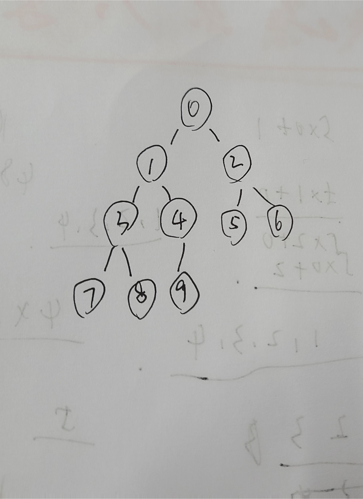
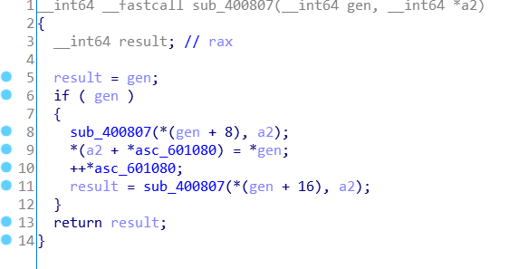
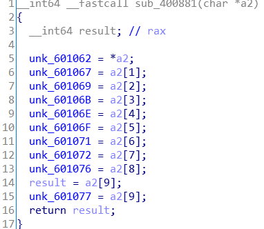
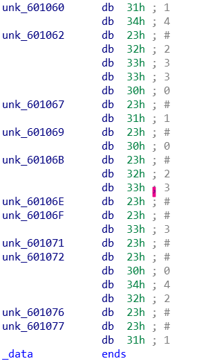
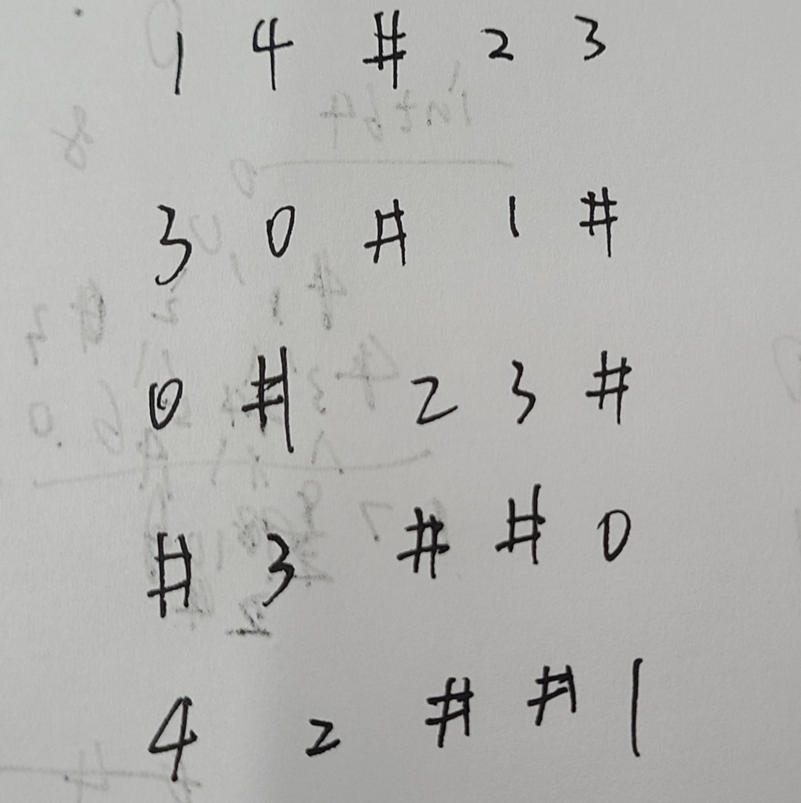

hash ctf 第一次实训re_easytree

ida打开，简单分析一下

sub_400758是按层次建立一颗完全二叉树

a2是当前结点的下标，左孩子2\*a2+1，右孩子2\*a2+2，返回根结点。

所以是这样的二叉树，数字是输入的字符数组下标

sub_400807是二叉树的中序遍历，

这里的gen是int64，所以+8就是到gen后面的那个数，而在建立二叉树的时候，我们把左孩子令成结点[1]，右孩子令成结点[2],所以这里+8是左孩子，后面+16是右孩子，知道这些以后，稍微推一推，就知道这是中序遍历，a2保存中序遍历的结果。

sub_400881是填空，用a2填#在的位置

sub_400917是check函数，分析一下，知道这是个5*5的数独，行不能有相同的，列不同有相同的

把这些#填上，即0421421430，这就是中序遍历的结果，再把其转换成按层次顺序的二叉树，即1134240024，套上flag即可

flag{1134240024}

