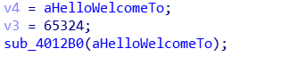
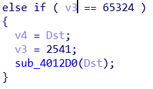
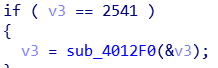
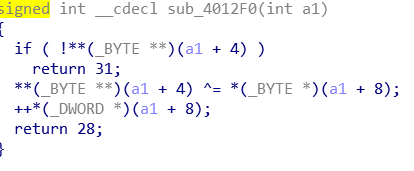
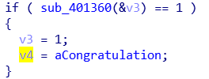
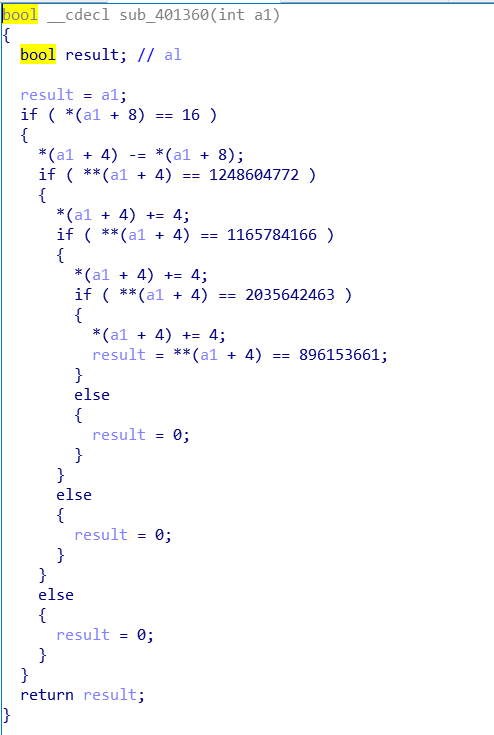
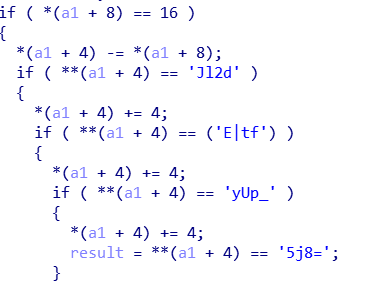
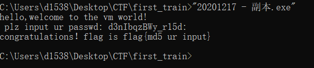

第一次集训的题

先直接放ida打开，shift+f12找字符串，进入到主函数里面f5，先分析一波，因为v3开始为0，所以直接就到了这里



v4就是欢迎语，sub_4012B0点进去就是printf，v3=65324

然后回到前面



sub_4012d就是scanf，然后v3=2541

到2541那个分支去





这里关键是弄明白a1+4和a1+8是什么。让我们回到前面


a1是v3的指针，a1+4应该是指的是挨着v3的下一个变量（因为v3是int）。即a1+4=v4，而v4是个char*，指向dst，即输入的字符。这里**v4应该是取v4的值，第一个if是判断结束的跳转，当v4=0是返回31，即31应该是结束的分支，出去看下也能知道，当v3=31的时候不break，就能进入下面的congratulation。

那么*(a1+8)应该指的是v5，v5=0，这里让输入的字符异或0，然后v5+1=1，返回28。v3=28时，会再次进入输入的那个分支，也说明了它是一位一位输入的，之后又会来到这个分支，只有当返回31，即输入结束时，就会跳到congratulation处的分支。

那么我们知道了，这里就是将输入的每一位异或依次异或上0,1,2,3,4....

我们来到congratulation这个分支



进入sub_401360



我们知道*a1+8=v5，这里判断v5是否=16，即我们的输入长度得=16，后面 *a1+4-=16，应该是让v4即输入，指向第一个输入的位置。然后每个if判断都比较4位，一共比较4次，后面这些数字指的应该都是字符串，转换一下。



然后每个字符串是用小端序存的。

所以就是`d2lJft|E_pUy=8j5`,再异或一下

```python
s='d2lJft|E_pUy=8j5'
j=0
a=''
for i in s:
    k=ord(i)^j
    j+=1
    a+=chr(k)
print(a)
```

`d3nIbqzBWy_r15d:`



再md5一下，套上flag

flag{cd91ba698aec8904624f6e4d6a645fd9}